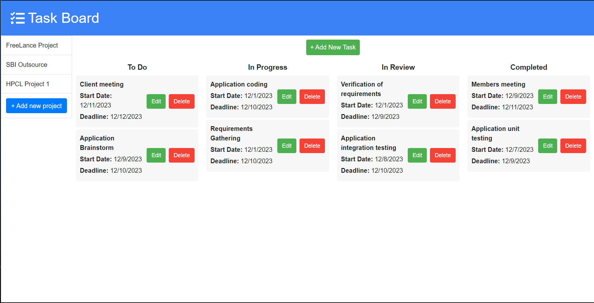
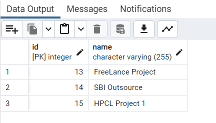
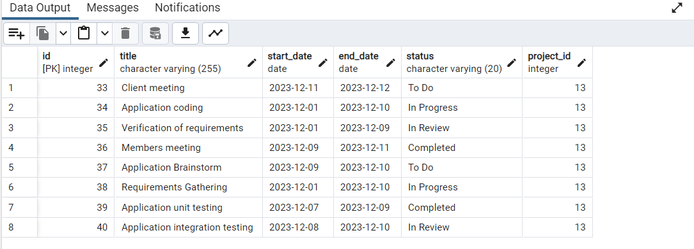

# To-do-application 
# Project Description
A task management application that helps users organize their projects and tasks efficiently. Whether you're working on personal projects, collaborating with a team, or managing your daily to-dos, It provides a user-friendly interface to keep everything in order.

## Screenshot

## Features
- Project Management: Create and manage multiple projects effortlessly.

- Task Tracking: Add tasks with details such as title, start date, deadline, and status.

- Task Status: Categorize tasks as "To Do," "In Progress," "In Review," and "Completed."

- Edit and Delete: Easily edit task details or remove tasks as needed.

- User-Friendly Interface: Intuitive design for a seamless user experience.

## Technologies Used
React: A JavaScript library for building user interfaces.

Axios: A promise-based HTTP client for making requests to the backend.

Node.js and Express: Backend server for handling requests and managing data.

PostgreSQL: A powerful open-source relational database used to store and manage the application's data.

CSS: Styling to enhance the visual appeal and user experience.

## Installation

Follow these steps to set up the To-do application locally on your machine:

### Prerequisites

Ensure you have the following tools installed on your machine:

- [Node.js](https://nodejs.org/): JavaScript runtime for executing JavaScript code server-side.
  
- [npm](https://www.npmjs.com/): Node.js package manager, which is included with the Node.js installation.
  
- [PostgreSQL](https://www.postgresql.org/): An open-source relational database.

### Steps

  1. **Clone the Repository:**

  2.**Navigate to the Project Directory:**

  3.**Install Dependencies:**

  4.**Database Setup:**

    ->Create a PostgreSQL database.
    ->Update the database connection configuration in server/db.js with your PostgreSQL credentials.

  5.**Run the Application:**
  
  6.**Access the Application:**
    Open your web browser and go to http://localhost:3000.

Now, you have To-do AlcoveX running locally on your machine. Start managing your projects and tasks efficiently!
